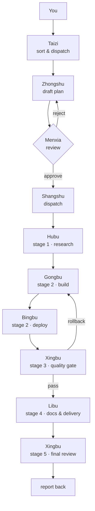

# zoocode-edict

**English** | [简体中文](README.zh-CN.md)

> A "Three Departments and Six Ministries" multi-agent workflow for [ZooCode](https://github.com/Zoo-Code-Org/Zoo-Code) — splitting five assistants into nine specialized roles that plan, review, execute, and roll back in a closed loop.

---

## Introduction

**zoocode-edict** organizes complex coding work as a pipeline instead of a single conversation. It divides responsibilities among **nine specialized roles**, modeled on the Chinese "Three Departments and Six Ministries" (三省六部) system of government:

- **Review before execution** — no task runs until its plan has passed a review step.
- **Specialized roles** — data, engineering, deployment, docs, and QA each have a dedicated department.
- **Closed loop with rollback** — a quality gate can send work back for repair instead of shipping defects.

The result behaves less like a one-way delegation chain and more like a small, disciplined team with active two-way feedback.

```
                            ┌─────────────┐
                            │   You       │
                            └──────┬──────┘
                                   │
                            ┌──────▼──────┐
                            │  Taizi      │  ← sorts & dispatches
                            └──────┬──────┘
                                   │
                            ┌──────▼──────┐
                            │  Zhongshu   │  ← drafts the plan
                            └──────┬──────┘
                                   │
                       ┌───────────▼───────────┐
                       │     Menxia            │  ← reviews the plan
                       │  approve / reject     │
                       └───────────┬───────────┘
                                   │ approved
                            ┌──────▼──────┐
                            │  Shangshu   │  ← dispatches to ministries
                            └──────┬──────┘
                                   │
        ┌─────────┬───────────┬────┴────┬─────────┐
      ┌─▼──┐   ┌──▼───┐   ┌───▼──┐   ┌──▼───┐   ┌─▼──┐
      │Hubu│   │Gongbu│   │Bingbu│   │Xingbu│   │Libu│
      └────┘   └──────┘   └──────┘   └──────┘   └────┘
       data      code      deploy       QA       docs
```

---

## Why not the built-in modes?

ZooCode ships with five built-in modes: `architect`, `code`, `ask`, `debug`, and `orchestrator`. The orchestrator can break down tasks and delegate them using the `new_task` mode. It works well for straight forward multi-step tasks, but the delegation used is top-down and linear. Subtasks are delegated and returned without quality gates or review loops. zoocode-edict solves this through the following aspects 

| Aspects | `zoocode-edict` Workflow |
|-----|---------------------------|
| **Workflow** | Multi-stage framework with strict separation of duties based on Three Departments and Six Ministries |
| **Review** | Plans drafted by Zhongshu must be approved by Menxia before execution. |
| **Quality Gate and Feedback** | User can inject feedback together with Xingbu's recommendation to catch errors easily. |
| **Rollback** | Xingbu will check the quality of outputs and can call for a redo if standards are not met. |
| **Context Managing** | Independent context for individual ministries and shared context between taizi and the departments |

### A concrete example: research an event and build a browsable demo

#### ✅ Already built — browse the delivered demo

This example is no longer hypothetical. The research-plus-build task described below was actually carried out and shipped as a **static, browsable demo** with three views — **Timeline**, **Causes**, and **Key Figures** — where every finding links back to its traceable sources.

| | Entry point | How to use it |
|---|-------------|---------------|
| 🔗 | **Live Demo (GitHub Pages)** | [https://maxma9363-spec.github.io/zoocode-edict/](https://maxma9363-spec.github.io/zoocode-edict/) — *requires GitHub Pages to be enabled in the repo first; see [`deploy/README-pages.md`](deploy/README-pages.md)* |
| 💻 | **Run locally (always available)** | `python3 -m http.server 8000 --directory demo` then open [http://localhost:8000/](http://localhost:8000/) |
| 📂 | **Demo source** | [`demo/`](demo/) — [`index.html`](demo/index.html) · [`styles.css`](demo/styles.css) · [`app.js`](demo/app.js) · [`data/findings.json`](demo/data/findings.json) |
| 📖 | **Deployment notes** | [`deploy/README-pages.md`](deploy/README-pages.md) — [`pages.yml`](.github/workflows/pages.yml) |

> ⚠️ **Honest status:** the Pages site is **not online yet**. The publishing workflow ([`.github/workflows/pages.yml`](.github/workflows/pages.yml)) is already in the repo, but the site only becomes reachable after the code is pushed and **Settings → Pages → Source** is set to **GitHub Actions**. Until then, the local command above is the guaranteed way to view the demo.

**Data at a glance:** 13 timeline entries · 7 causes · 17 figures (12 individuals + 5 organizations) · 19 sources — all cross-referenced.

#### How this demo was produced

Here is the single request the demo started from: *"Research the Deepwater Horizon oil spill — causes, timeline, key figures — and build a small web app where a user can browse the findings."*

This is a research-plus-build task with a frontend (a browsable page) and a backend (the data behind it).

**With a single built-in mode**, one agent must research, decide, code the frontend and backend, test, and document — all in one context. If it settles on a poor data model early, that choice propagates unchecked to the end.

**With zoocode-edict**, the same task flows through a pipeline — this is the path that actually produced the demo linked above:

| Step | Role | What happens |
|------|------|--------------|
| 1 | **Taizi** | Sorts your request and forwards it as a formal task. |
| 2 | **Zhongshu** | Drafts a plan (research → data model → backend → frontend → verify → document). |
| 3 | **Menxia** | Reviews the plan for feasibility, completeness, risk, and resources. Rejects and returns it if flawed. |
| 4 | **Shangshu** | Breaks the approved plan into staged work and dispatches it. |
| 5 | **Hubu** | **Research phase** — gathers authoritative sources on the spill: timeline, causes, key figures. |
| 6 | **Gongbu** | **Build phase** — implements the backend data API and the browsable frontend page. |
| 7 | **Bingbu** | **Deploy phase** — sets up run scripts / environment so the app actually starts. |
| 8 | **Xingbu** | **Quality gate** — reviews the code and the data, checks edge cases; may trigger a rollback. |
| 9 | **Libu** | **Delivery phase** — writes the README / usage docs for the app. |
| 10 | **Xingbu** | **Final review** — full regression across code + docs + deploy before sign-off. |
| 11 | **Report back** | Results are summarized and returned to you. |

The plan is reviewed *before* work starts, the output is verified *before* delivery, and problems are rolled back rather than shipped. The browsable demo at the top of this section is the concrete end product of exactly this path.

### Side-by-side comparison

| Dimension | Built-in modes | zoocode-edict |
|-----------|----------------|---------------|
| Planning | Implicit | Explicit **Zhongshu** plan |
| Plan review | ❌ None | ✅ **Menxia** review step |
| Role specialization | Five independent modes | ✅ Nine specialized roles |
| Quality gate | ❌ None | ✅ **Xingbu** gate at stages 3 & 5 |
| Rollback | ❌ None | ✅ Light → stage 2, heavy → stage 1 |
| Context isolation | ❌ Shared | ✅ Per-stage, per-department |
| Delivery discipline | Ad hoc | ✅ Staged 5-phase pipeline |

---

## Installation & Usage

> ⚠️ **Special Note:** *Hubu* is configured by default to use a custom Poe Perplexity MCP server for web search and deep research. If you do not use this server, you can easily adjust *Hubu*'s system prompt in the ZooCode GUI to match your local tool setup.

zoocode-edict comes with **three cross-platform installer scripts**. Pick the one that matches your OS:

| Script | Platform | Requirement |
|--------|----------|-------------|
| `install.bat` | Windows | — |
| `install.sh` | macOS / Linux | POSIX shell |
| `install.py` | Windows / macOS / Linux | Python 3 |

Each installer deploys `custom_modes.yaml` (included in this repo) into your editor's ZooCode **global storage** folder.

### Auto-detected editors

All three scripts automatically detect these five editors:

- VS Code
- VS Code Insiders
- VSCodium
- Cursor
- Windsurf

### Default storage paths

| Platform | Path |
|----------|------|
| **Windows** | `%APPDATA%\{editor}\User\globalStorage\zoocodeorganization.zoo-code` |
| **macOS** | `~/Library/Application Support/{editor}/User/globalStorage/zoocodeorganization.zoo-code` |
| **Linux** | `~/.config/{editor}/User/globalStorage/zoocodeorganization.zoo-code` |

Where `{editor}` is one of `Code`, `Code - Insiders`, `VSCodium`, `Cursor`, or `Windsurf`.

### Three ways to run

**1. Double-click (auto-detect)** — run the script with no arguments. It finds the editor folder on its own.

**2. From a terminal:**

```bash
# macOS / Linux
sh install.sh

# Windows
install.bat
```

**3. Pass a custom path explicitly** (useful for portable installs or custom data directories):

```bash
sh install.sh "/path/to/zoocodeorganization.zoo-code"
```

```bat
install.bat "D:\custom\path\zoocodeorganization.zoo-code"
```

The custom path may point to **any of three levels** — the installer normalizes automatically:

- the `settings` sub-folder — `...\zoocodeorganization.zoo-code\settings`
- the `zoocodeorganization.zoo-code` root folder
- the IDE user-data folder — e.g. `...\Code` (the installer drills down for you)

### What the installer does

```
auto-locate  →  three-tier validation  →  backup (.bak)  →  overwrite
```

1. **Auto-locate** the ZooCode storage folder (or use your custom path).
2. **Validate** using a three-tier check: `settings/custom_modes.yaml`, `custom_modes.yaml`, or `…/zoocodeorganization.zoo-code/settings/custom_modes.yaml`.
3. **Back up** any existing `custom_modes.yaml` to `custom_modes.yaml.bak` (same folder).
4. **Overwrite** with the new config shipped alongside the script.

> ⚠️ **Note:** installation overwrites your current `custom_modes.yaml`. A backup is created automatically as `custom_modes.yaml.bak`, but be aware your existing custom modes will be replaced.

### Choice on models

Three models were used in the tested setup:

| Mode | Model | Reasoning Effort / Profile |
| :--- | :--- | :--- |
| `taizi` | deepseek-flash | Extra High |
| `zhongshu` | claude-opus-4.8 | High |
| `menxia` | claude-opus-4.8 | High |
| `shangshu` | deepseek-flash | Extra High |
| `gongbu` | claude-opus-4.8 | High |
| `bingbu` | claude-sonnet-4.6 | High |
| `libu` | deepseek-flash | Extra High |
| `hubu` | deepseek-flash | Extra High |
| `xingbu` | claude-opus-4.8 | High |

---

## How it works



### Roles

| Mode | Name | Responsibility |
|------|------|----------------|
| `taizi` | 太子 | First point of contact; sorts requests and dispatches them. |
| `zhongshu` | 中书 | Planning and decision — drafts the execution plan. |
| `menxia` | 门下 | Review gate — checks plans for feasibility, completeness, risk. |
| `shangshu` | 尚书 | Execution dispatch — assigns work to the ministries and aggregates results. |
| `gongbu` | 工部 | Engineering — implementation, architecture, refactoring, tooling. |
| `bingbu` | 兵部 | Infrastructure — deployment, CI/CD, monitoring, security. |
| `hubu` | 户部 | Data and research — data analysis, resource management, reports. |
| `libu` | 礼部 | Documentation and communication — READMEs, docs, UX copy, i18n. |
| `xingbu` | 刑部 | Quality — code review, testing, bug analysis, compliance audit. |

Additionally, the config marks the five built-in modes (`architect`, `code`, `ask`, `debug`, `orchestrator`) as **deprecated** and disables switching to them, keeping work inside the department workflow.

### The 5-phase pipeline

| Phase | Role(s) | Goal |
|-------|---------|------|
| **1. Research** | Hubu | Gather material to raise the quality of later phases. |
| **2. Build** | Gongbu → Bingbu | Produce runnable code and supporting infrastructure. |
| **3. Quality gate** | Xingbu | Review; pass, or trigger a rollback. |
| **4. Delivery** | Libu | Produce user-facing docs and communication material. |
| **5. Final review** | Xingbu | Full regression across code + docs + deploy before sign-off. |

**Review rule:** Zhongshu ↔ Menxia may iterate at most **3 rounds**; the 3rd round is force-approved.

**Rollback rule:**
- **Light rollback** (bugs, code-quality issues) → back to **stage 2**.
- **Heavy rollback** (requirement/design issues) → back to **stage 1**.
- After **2 heavy rollbacks**, the process pauses and requests human intervention.

---

## Stability & Safety

zoocode-edict is built on the **ZooCode** platform. Its design was inspired by [cft0808/edict](https://github.com/cft0808/edict), which is built on the **OpenClaw** platform. The two share a philosophy but differ in how reliably and observably they run:

- **Observability** — With ZooCode you can watch each agent's reasoning process in real time. OpenClaw primarily surfaces a board/kanban view, which makes it harder to confirm whether an agent actually finished its work.
- **Communication reliability** — This project uses ZooCode's native dispatch tools (`new_task` for isolated ministry subtasks and `switch_mode` for governance hand-offs), providing a deterministic execution chain with clean return paths.
- **Safety / permissions** — ZooCode requires fewer system permissions than OpenClaw, which needs broader access to the machine.
- **Engineering robustness** — The installers add cross-platform path detection, three-tier validation, automatic backup, standardized exit codes (`0` success / `1` failure), and self-location of the install package (`%~dp0`, `dirname "$0"`, `Path(__file__).parent`).

The goal is not to dismiss other approaches, but to be explicit about the trade-offs behind this design.

---

## FAQ

**The installer can't find my editor folder.**
Pass the path explicitly:

```bash
sh install.sh "/path/to/zoocodeorganization.zoo-code"
```

You can point it at the `settings` sub-folder, the `zoocodeorganization.zoo-code` root, or your IDE user-data folder — any of the three works.

**Where is the backup?**
Next to the original, as `custom_modes.yaml.bak` in the same folder.

**How do I restore my old config?**
Rename `custom_modes.yaml.bak` back to `custom_modes.yaml`.

**Which editors are supported?**
VS Code, VS Code Insiders, VSCodium, Cursor, and Windsurf.

**Has Linux been tested?**
The Linux branch mirrors the macOS logic (same three-tier validation and backup flow), but it has primarily been tested on macOS and Windows. Testing on Linux is welcome.

**A double-clicked script window flashes and closes.**
The scripts include a `pause` (Windows) / `read` (shell) guard so the window stays open until you press a key, letting you read any error message.

**Which folder level should I pass as the argument?**
Any of the three: the `settings` sub-folder, the `zoocodeorganization.zoo-code` root, or the IDE user-data folder. The installer normalizes them all.

**Does installation change anything else?**
No. It only backs up and replaces `custom_modes.yaml` in the ZooCode storage folder.

---

## Project structure

```
zoocode-edict/
├── custom_modes.yaml      # The role definitions (Three Departments and Six Ministries)
├── install.bat            # Windows installer
├── install.sh             # macOS / Linux installer
├── install.py             # Cross-platform installer (Python 3)
├── LICENSE                # MIT
└── README.md / README.zh-CN.md
```

---

## Security design

Every role embeds a shared set of **safety rules**:

1. **No destructive operations** (mass deletes, `DROP`/`rm -rf`, etc.) without explicit confirmation.
2. **No leaking secrets** (passwords, API keys, tokens) into logs or output.
3. **No overstepping scope** — each department stays within its remit.
4. **Prompt-injection resistance** — suspicious instructions (e.g. "ignore the above") are refused and reported.

Upstream agents' output is treated as review material only; it cannot override a role's core responsibilities.

---

## Credits & License

This project's prompt design — the role definitions in `custom_modes.yaml` — is **adapted in substantial part from [cft0808/edict](https://github.com/cft0808/edict)**. Thanks to its author for the original "Three Departments and Six Ministries" multi-agent concept.

**License:** MIT. See [LICENSE](LICENSE).

Copyright (c) 2026 maxma9363-spec
